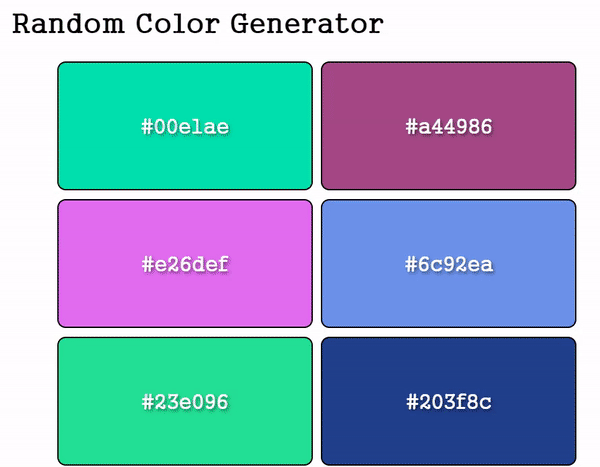

# Random-Color-Generator


## 효과   
새로고침을 하면 색상이 랜덤으로 추천

## 학습  
### 1. JS : Math.floor() 
소수점 이하를 버림  
```
console.log(Math.floor(5.95));
// Expected output: 5

console.log(Math.floor(5.05));
// Expected output: 5

console.log(Math.floor(5));
// Expected output: 5

console.log(Math.floor(-5.05));
// Expected output: -6

```

### 2. JS : substring()
- string 객체의 시작 인덱스로 부터 종료 인덱스 전 까지 문자열의 부분 문자열을 반환
  
- 문자열에서 두 인덱스(위치) 사이의 문자를 추출합니다. 즉, 하위 문자열을 반환합니다.

- 처음부터 끝까지(제외) 문자를 추출합니다.

- 원래 문자열을 변경하지 않습니다.

- 시작이 끝보다 크면 인수가 교체됩니다: (4, 1) = (1, 4).

- 0보다 작은 시작 또는 끝 값은 0으로 처리됩니다.

```
const str = 'Mozilla';

console.log(str.substring(1, 3));
// Expected output: "oz"

console.log(str.substring(2));
// Expected output: "zilla"

```

*cf. split(), slice(), substr() 비교하기*
substring()|split()|slice()|substr()
---|---|---|---|
문자열에서 두 인덱스(위치) 사이의 문자를 추출|문자열을 하위 문자열 배열로 분할|문자열의 일부를 추출|문자열의 일부를 추출
처음부터 끝까지(제외) 문자를 추출|새 배열을 반환|추출된 부분을 새 문자열로 반환|지정된 위치에서 시작하여 지정된 수의 문자를 반환
원래 문자열을 변경하지 않습니다|원래 문자열을 변경하지 않습니다.|원래 문자열을 변경하지 않습니다.|원래 문자열을 변경하지 않습니다.
시작이 끝보다 크면 인수가 교체됩니다: 예) (4, 1) = (1, 4) / 0보다 작은 시작 또는 끝 값은 0으로 처리|(" ")를 구분 기호로 사용하면 문자열이 단어 간에 분할|시작 및 끝 매개변수는 추출할 문자열 부분을 지정|문자열 끝에서 문자를 추출하려면 음수 시작 위치를 사용


**split( )**

```
const str = 'The quick brown fox jumps over the lazy dog.';

const words = str.split(' ');
console.log(words[3]);
// Expected output: "fox"

const chars = str.split('');
console.log(chars[8]);
// Expected output: "k"

const strCopy = str.split();
console.log(strCopy);
// Expected output: Array ["The quick brown fox jumps over the lazy dog."]

```


**slice( )**
```
const str = 'The quick brown fox jumps over the lazy dog.';

console.log(str.slice(31));
// Expected output: "the lazy dog."

console.log(str.slice(4, 19));
// Expected output: "quick brown fox"

console.log(str.slice(-4));
// Expected output: "dog."

console.log(str.slice(-9, -5));
// Expected output: "lazy"

```

**substr( )**
```
const str = 'Mozilla';

console.log(str.substr(1, 2));
// Expected output: "oz"

console.log(str.substr(2));
// Expected output: "zilla"

```

## 학습 출처
**- 유튜브**   
https://www.youtube.com/@JavaScriptKing   

**- JS**    
https://www.w3schools.com/jsref/jsref_floor.asp   
https://developer.mozilla.org/ko/docs/Web/JavaScript/Reference/Global_Objects/Math/floor    
https://developer.mozilla.org/ko/docs/Web/JavaScript/Reference/Global_Objects/String/substring    


